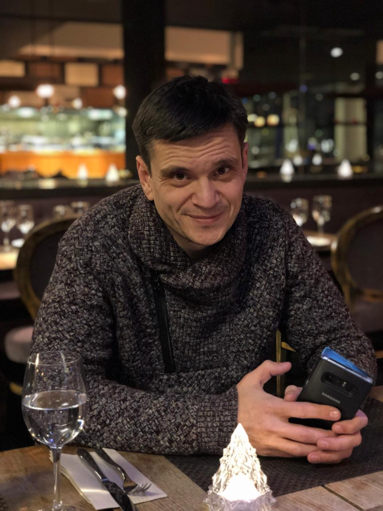

# Всем привет! Меня зовут Григорий Рачков
# Сейчас я учусть в Нетологии, чтобы:
## 1. Освоить язык Python
## 2. Научиться писать парсеры к маркетплейсам
## 3. Научиться создавать и размещать сайты

### Мое фото 